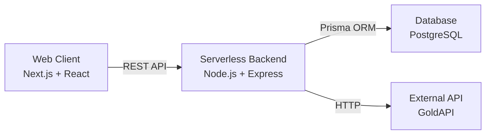

# 💎 GemTrack
### A Comprehensive Web POS & Inventory System for Jewelers

## 📖 Overview

**GemTrack** empowers jewelers to manage their entire business from a modern, responsive web dashboard.

Traditionally, jewelers are forced to choose between **desktop POS systems** (clunky and outdated) and **basic mobile apps** (too simplistic). GemTrack bridges this gap by providing a professional-grade Point of Sale (POS) and inventory system in a sleek **Next.js Web Application**.

It handles complex jewelry data—such as **HUID, Wastage, Making Charges, and Stone Charges**—while allowing the owner to manage stock, customers, and sales from any device.

---

## 🚀 Key Features

### 🛡️ Authentication & Security
* Secure User Registration & Login.
* **JWT-based** authentication for all protected routes.

### 💍 Advanced Inventory Management
* **Deep Detail Tracking:** Supports HUID, SKU, Purity, Gross/Net Weight, Making Charges, Wastage %, GST %, and Stone Charges.
* **Barcode Integration:** Generate and print barcode labels directly from the browser.
* **Visual Inventory:** Rich product displays with detailed attributes.

### 👥 Customer & Sales Management
* **Customer Profiles:** Manage Name, Phone, Email, Address, and PAN Card details.
* **Web POS:** Fast checkout experience with automatic inventory updates and invoice generation.
* **Sales History:** Comprehensive transaction logs with status tracking (Paid/Partial/Unpaid).

### 📊 Business Intelligence
* **Dashboard:** Real-time analytics, revenue trends, and stock composition charts.
* **Market Insights:** Live gold and silver market rates via GoldAPI.

### ⚡ Performance & Scalability
> *Designed to handle 10,000+ items instantly.*
* **Pagination:** All data-heavy lists (Inventory, Customers, History) are paginated.
* **Server-Side Search:** Fast searching by Name, Phone, SKU, or HUID.
* **Optimized Loading:** Partial data fetching ensures the dashboard loads instantly even if external APIs are slow.

---

## 🛠️ Tech Stack

| Component | Technology |
| :--- | :--- |
| **Frontend** | Next.js (App Router), React, TailwindCSS, Shadcn UI |
| **Backend** | Node.js, Express.js (Serverless Function) |
| **Database** | PostgreSQL (Neon), Prisma ORM |
| **Auth** | JSON Web Tokens (JWT), bcrypt.js |
| **Hosting** | Vercel (Frontend & Backend) |
| **External APIs** | GoldAPI.io (Market Rates) |

---

## 🏗️ System Architecture

The system follows a modern Serverless Web architecture:

